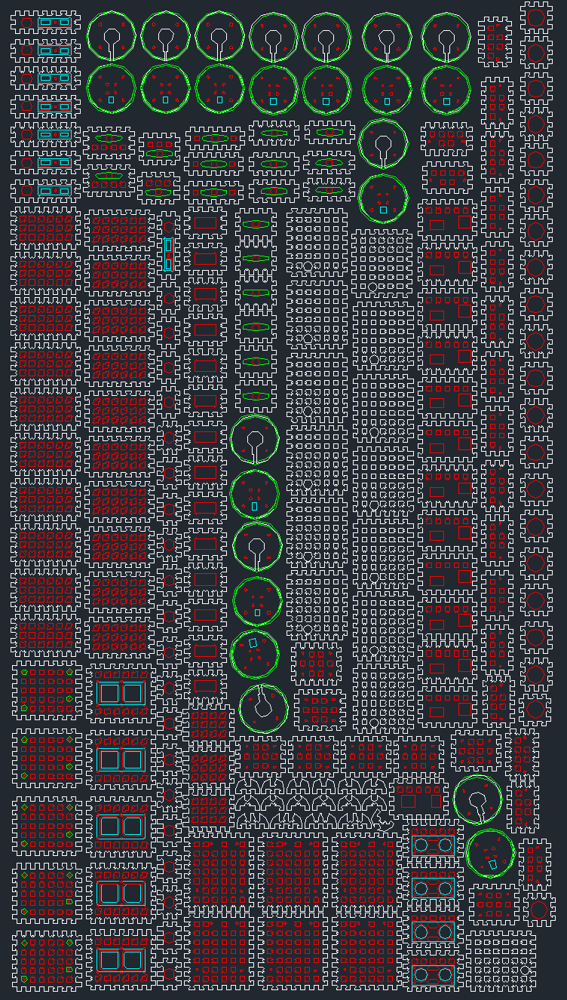

# Structor
Конструктор из 5 мм вспененного ПВХ для изготовления корпусов DIY-электроники

Constructor of 5 mm of PVC foam for the manufacture of shells diy-electronics

  

  
Template <a href="https://github.com/lastralab/Structor/blob/master/interfaces/110x62cm.dxf">110x62cm.dxf</a>:
  

  
